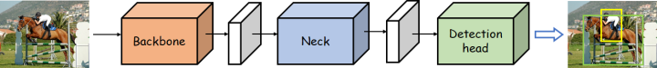
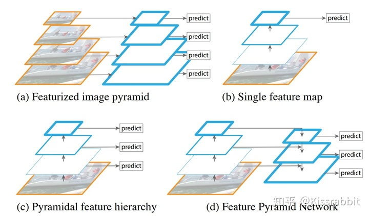
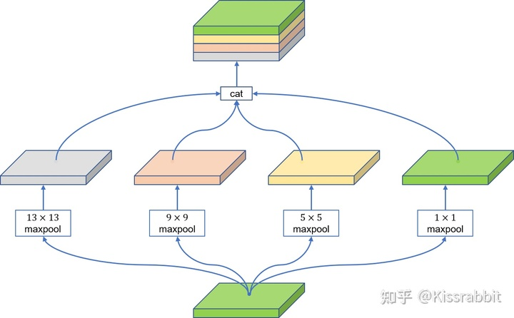
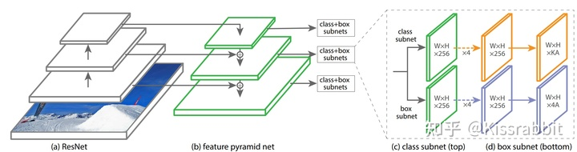
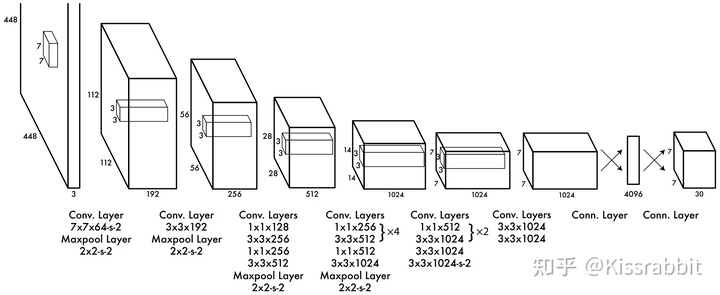
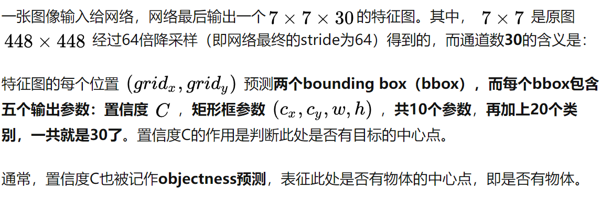
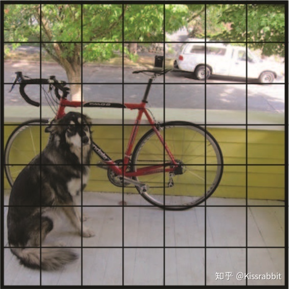
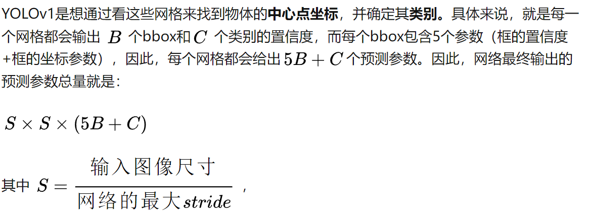

# YOLO

## 问题

### 852.jpg用cv2.imread读取出来为none

```python
# 若为none则使用PIL.Image来读取
img = cv2.imread(path.replace("\\", "\\\\"))  # BGR
if img is None:
    img = Image.open(path)
    img = cv2.cvtColor(np.asarray(img), cv2.COLOR_RGB2BGR)
    assert img is not None, 'Image Not Found ' + path.replace("\\", "\\\\")
```

## 思路

### complex yolo

[YOLO系列专题——Complex-YOLO - 知乎 (zhihu.com)](https://zhuanlan.zhihu.com/p/339099357)

将点云转为图像放入yolo


## 目标检测

一个常见的目标检测网络，其本身往往可以分为一下三大块：



### **Backbone network**

即**主干网络**，是目标检测网络最为核心的部分，大多数时候，backbone选择的好坏，对检测性能影响是十分巨大的。

### **Neck network**

即**颈部网络**，Neck部分的主要作用就是将由backbone输出的特征进行整合。其整合方式有很多，最为常见的就是FPN（Feature Pyramid Network）：




在SSD之前，不论是Faster R-CNN还是YOLO，他们都只是在backbone输出的最后一层很粗糙的特征图（feature map）上去做检测的。在CNN中，有一个很关键的概念叫做“感受野”（receptive field），大抵的意思就是**这一张特征图的pixel能包含原始图像中的少个像素**。直观上来看，backbone最后输出的很粗糙的特征图——通常都是stride=32，即经过了32倍降采样——具有很大的感受野，这对于大物体来说是很友好的，但对于小物体而言，过大的感受野且不说容易“失焦”，经过多次降采样，小物体的信息也很容易被丢失掉了。

为了解决这么个问题，SSD在三个不同大小的特征图上进行预测，即上图中的（c），但CNN随着网络深度的增加，每一层的特征图所携带的信息量和信息性质也不一样——浅层包含的细节信息、轮廓信息、位置信息等更多，深层包含的语义信息更多。因此，FPN的工作就是在检测前，先将多个尺度的特征图进行一次bottom-up的融合，也就是上图中的（d），这被证明是极其有效的特征融合方式，几乎成为了后来目标检测的标准模式之一。

除了FPN，还有SPP模块，这也是很常用的一个Neck结构，下图便是SPP的结构示意图：



除此之外，还有：

1. **RFB**：出自《**Receptive Field Block Net for Accurate and Fast Object Detection**》

2. **ASPP**：出自《**DeepLab: Semantic image segmentation with deep convolutional nets, atrous convolution, and fully connected CRFs**》

3. **SAM**：出自《**CBAM: Convolutional block attention module**》

4. **PAN**：出自《**Path aggregation network for instance segmentation**》。PAN是一个非常好用的特征融合方式，在FPN的bottom-up基础上又引入了top-down二次融合，有效地提升了模型性能。


### **Detection head**

即**检测头**，这一部分的作用就没什么特殊的含义了，就是若干卷积层进行预测，也有些工作里把head部分称为decoder（解码器）的，这种称呼不无道理，head部分就是在由前面网络输出的特征上去进行预测，约等于是从这些信息里解耦出来图像中物体的类别和位置信息。



RetinaNet最后的detection head部分就是三条并行的分支，每个分支右4层普通卷积堆叠而成。

## YOLO V1

### 网络架构

YOLO-v1最大的特点就在于：**仅使用一个卷积神经网络端到端地实现检测物体的目的**。其网络整体的结构如下图所示：



YOLO-v1的backbone网络是仿照GoogLeNet搭建的，但并没有采用Inception模块，而是使用 $1\times1$和$3\times3$ 卷积层来堆砌的，所以网络的结构是非常简单的。基本上，照葫芦画瓢，我们就能搭建出整体的网络。

在那个年代，图像分类任务中，网络最后会将卷积输出的特征图拉平（**flatten**），得到一个一维向量，然后再接若干全连接层做预测。

YOLO-v1继承了这个思想，最后的$7\times7\times1024$的特征图成大小$7\times7\times1024$的向量，这个一维向量再接一层全连接层。

事实上，YOLOv1本身最大的弊端就在于“**flatten”**这种方式本身。

基本上，对于“**flatten方式会破坏特征的空间结构信息**”的这一观点已经成为业界共识。现在几乎看不到还有哪个one-stage检测模型还会用全连接层来做检测了。

另外，我们注意到，YOLOv1中并没有使用**BatchNormalization（BN）**，这是因为在那个时候，BN还没有兴起。

### 检测原理



首先，网络的输入是$448\times448$的图片，经过网络64倍的降采样后，最后的卷积输出是$7\times7$的在这里停一下，因为这里就体现了YOLOv1的核心思想，也是自此之后绝大部分的one-stage检测的核心范式：

**逐网格找东西**。

具体来说就是，这个 $7\times7$ 相当于把原来的图片进行了![[公式]](https://www.zhihu.com/equation?tex=7%5Ctimes7)等分，如下图所示：






### YOLOv1的正样本制作方法
