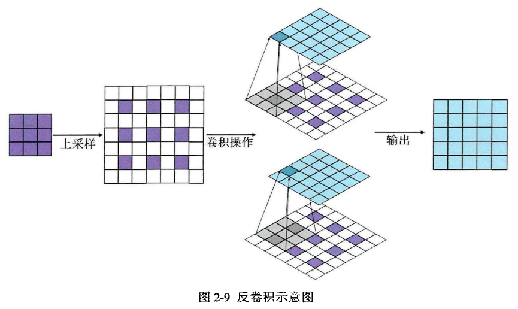
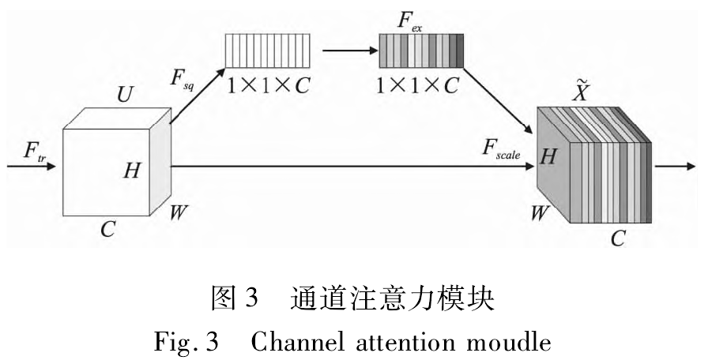
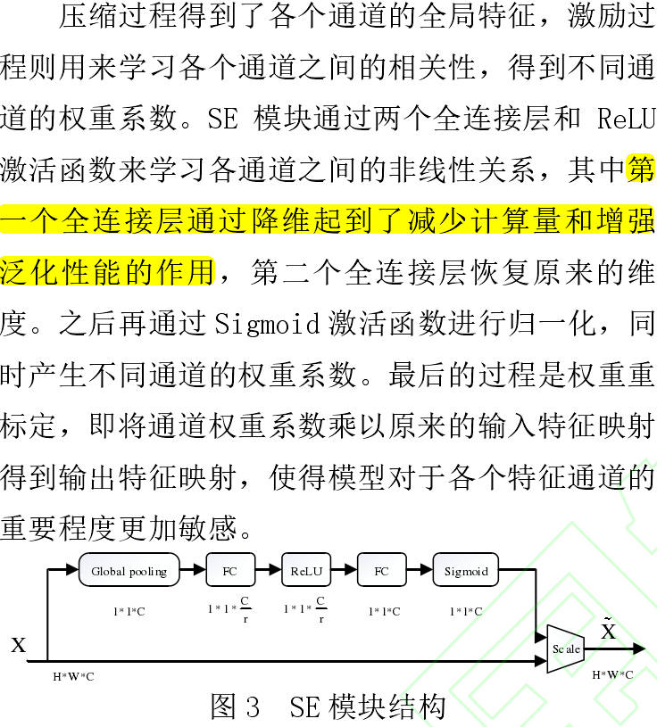

## 生成对抗神经网络

生成对抗神经网络（ＧＡＮ）主要由两个部分组成：生成器和判别器

现有的基于生成对抗网络的数据扩充方式仅仅是将生成的数据作为训练集来进一步增强行人再识别模型的性能，但扩充数据集的质量好坏很难把控。

> 融合多尺度注意力的太赫兹图像目标检测研究

## 反卷积

反卷积实际上是将一个较小分辨率的特征进行映射，变为一个拥有较大分别率的图像，该操作也叫上采样。常见的上采样方式有三种：反卷积，反池化，与双线性插值。在生成对抗神经网络中，采用反卷积算法。

反卷积包含两个步骤，上采样与正向卷积操作。

## 通道注意力模块

利用注意力机制对特征图各通道间的依赖性进行建模，通过权重值大小表征各个通道的重要程度，获得显著性特征映射，指导网络重点关注信息量丰富的特征

> 一种基于YOLOv5s和图像融合的行人检测方法

## 膨胀卷积

膨胀卷积也称空洞卷积，最早被提出用于图像分割． 膨胀卷积在原卷积核中插入不同数量的空洞来扩展卷积的大小，可以在不增加计算复杂度的同时扩展卷积层的感受野． 

膨胀卷积在原始卷积的基础上增加一个参数膨胀率，通过控制膨胀率的大小对卷积核进行不同数量的空洞填充，能够扩展网络的感受野而不降低特征图的分辨率．

